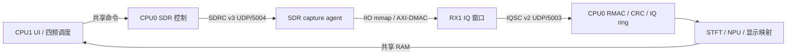

# RA8P1 与 SDR 对接指南

本文面向 RA8P1、SDR 和上位机联调工程师。包内旧交接文档保留作历史参考，当前交付状态和换频保护说明以本文及 `PACKAGE_INFO_CURRENT.txt` 为准。

## 1. 系统链路



CPU1 负责 UI、四频计划和结果可见确认；CPU0 负责请求、会话、完整性检查、环形缓冲、STFT、NPU 与结果发布；SDR 只响应 CPU0 的采集请求，不自主扫频。

## 2. 固定接口

| 项目 | 定义 |
|---|---|
| SDR 地址 | `192.168.31.10/24` |
| RA8P1 地址 | `192.168.31.20/24` |
| SDRC 控制面 | v3，UDP `5004` |
| IQSC 数据面 | v2，UDP `5003` |
| 旧诊断服务 | UDP `5002`，不作为正式高速数据面 |
| 中心频点 | `2420`、`2464`、`5760`、`5816 MHz` |
| RX 数据 | RX1，S16 little-endian，交织 `I,Q` |
| 采样率 / 带宽 | `60 MSPS / 56 MHz` |
| 发布窗口 | `590,336` complex samples，`2,361,344` bytes |
| 单窗 RF 时长 | `9.838933 ms` |

SDRC 使用 `request_id`、`session_id` 和 `boot_epoch` 绑定一次请求。IQSC 窗口包含 START、DATA、END，检查序号、sample index 和 CRC32C。CPU0 完成接收和分析后再返回 `WINDOW_ACK` 与下一窗口 credit。

## 3. 换频与 FIFO 保护

当前 mmap adapter 只在中心频率实际变化后保护下一次采集：

1. 调谐完成后保持 DMA 关闭至少 `1,000 us`。
2. 下一次 DMA 多采 `4,096` 个 complex samples，约 `68.3 us @ 60 MSPS`。
3. 丢弃多采窗口的前 `4,096` 个样本，只发布后面的 `590,336` 个样本。
4. 同频连续采集不重复支付该开销。

可控 A/B 参数：

```sh
RA8P1_IIO_TUNE_SETTLE_US=1000
RA8P1_IIO_TUNE_DISCARD_SAMPLES=4096
```

两项同时设为 `0` 可关闭保护。成功使用保护的窗口在 agent trace 中应出现：

```text
last_capture_tune_guarded=1
```

该实现隔离调谐瞬态和 DMA/FIFO 中可能残留的旧样本，但 IIO ABI 没有提供可证明的 FPGA FIFO reset，因此不能把它描述为“硬件 FIFO 已复位”。若板端仍观察到跨频残留，应逐档增加 discard 样本并保存对应 trace 和 IQ 证据。

## 4. SDR 构建与部署

本包新构建产物位于 `artifacts/sdr/current_tune_guard/`。其中 mmap adapter 包含本次换频保护；同目录的 agent 和 adapter 已通过 ARM hard-float/GLIBC 兼容检查、主机 ABI 检查和 RX1 前缀丢弃单元测试。

重新构建可在带 ARM cross toolchain 的 Linux/WSL 中执行：

```sh
./tools/build_sdr_capture_agent_armhf.sh ./artifacts/sdr/current_tune_guard
```

将当前产物上传到 SDR 的 `/tmp`，在 SDR 上先核对 `sha256sum`，再启动：

```sh
chmod +x /tmp/sdr_capture_agent
RA8P1_IIO_TUNE_SETTLE_US=1000 \
RA8P1_IIO_TUNE_DISCARD_SAMPLES=4096 \
RA8P1_SDR_UDP_GSO=1 \
RA8P1_SDR_CRC_BACKEND=nibble \
  /tmp/sdr_capture_agent 192.168.31.20 \
  --adapter /tmp/sdr_adapter_iio_mmap.so --trace \
  >/tmp/sdr_capture_agent.log 2>&1 &
```

正式联调必须使用 `current_tune_guard/` 中成对的新 agent 和 adapter。`artifacts/sdr/` 根目录下带旧哈希名的文件早于本次源码改动，只用于历史追溯，不包含当前换频保护保证。

## 5. RA8P1 构建与烧录

环境基线：Renesas FSP `6.4.0`、MCU `R7KA8P1KFLCAC`、GCC Arm `13.2.Rel1`、SEGGER J-Link。

```powershell
Set-Location <解压后的包目录>
& .\build-solution.ps1
& .\verify-solution.ps1 -SkipBuild
```

CPU0 与 CPU1 必须作为一个 multicore solution 烧录。不要单独烧录 CPU1：

```powershell
& .\flash-solution.ps1 -ProbeSerial <探针序列号> -Run
```

`artifacts/ra8p1/` 中 CPU0/CPU1 ELF 与 MAP 已更新为 2026-07-29 实际烧录并验收的快照。源码有变化时，仍应以重新构建得到的 ELF 和新 SHA-256 为准。

## 6. 联调顺序

1. 连接 SDR 与 RA8P1 的运行时以太网，确认地址分别为 `192.168.31.10` 和 `192.168.31.20`。
2. 上传并启动 `current_tune_guard/` 对应的 SDR agent 与 mmap adapter，保存启动命令和 SHA-256。
3. 构建、验证并以 multicore 方式烧录 CPU0/CPU1。
4. 先做单频采集，再按 `2420 -> 2464 -> 5760 -> 5816 MHz` 做四频循环。
5. 关联同一 `request_id/session_id` 的 SDR trace、CPU0 trace、网络统计和 CPU1 visible 记录。

最小验收条件：

- SDR trace 显示正确频点、样本数和 `last_capture_tune_guarded=1`。
- CPU0 的 session/sequence/sample index/CRC32C 全部通过。
- `sequence_gaps=0`、`crc_errors=0`、`ring_full_drops=0`、`ring_oversize_drops=0`。
- CPU0 完成 STFT/NPU 与 display frame 发布，CPU1 有对应的 visible 确认。
- 单频连续窗口和四频切换窗口均无旧频点数据串入。

## 7. 验证边界

本交付已完成的是：当前源码快照、新 SDR ARM 产物编译、ABI 检查、mmap RX1 copy/换频前缀丢弃单元测试、双核构建与 `Debug_Multicore` 烧录，以及真实 SDR 到 RA8P1 的端到端采集验收。2026-07-29 的 50 个真实窗口在 5.49 s 内完成，payload 为 370-393 Mbps；retry、timeout、gap、reorder、IQ invalid、CRC error 和 ring drop 增量均为 0，CPU1 实测 28.497 FPS。完整哈希摘要见 `evidence/tune_guard_e2e_20260729/`。

本次验收不构成 FPGA FIFO reset 的电气级证明，也不替代长时间四频压力测试或真实 NPU 模型准确率验收。当前 tune-guard 程序只在 SDR 的 `/tmp` 中运行，尚未写入 `/mnt/jffs2` 持久化；重启 SDR 后需重新部署。后续板端结论必须绑定对应 ELF、agent、adapter 的 SHA-256 和同批 trace。
