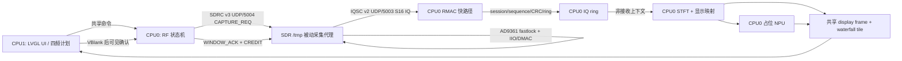

# RA8P1 SDR 无人机识别工程交接（分享快照）

> 交接快照：2026-07-25（Asia/Shanghai）  
> 工程根目录：`ra8p1_sdr_stft_npu_display_solution_20260719`  
> 本文件优先于旧的 `PROJECT_HANDOFF_20260723.md` 和历史 `README.md`；旧文档保留仅作历史参考。

## 1. 交接目标

交付一套 RA8P1 双核 SDR 无人机检测工程：CPU1 负责屏幕 UI 和高层扫描计划，CPU0 负责 SDR 控制、IQ 接收、CRC、STFT、NPU 以及结果发布。四频点按 `2420 → 2464 → 5760 → 5816 MHz` 自动循环。

当前阶段的正确目标是先保证**真实 IQ 到显示/推理结果的完整闭环**，再按真实测量优化总耗时。模型权重仍为占位权重，因此只能验证数据流和推理执行，不能声称无人机识别准确率已经验收。

## 2. 绝对约束

- 不修改 SDR 固件镜像、FPGA HDL、U-Boot、rootfs、启动脚本或现有 SDR IP。
- SDR 保持 `192.168.31.10`；RA8P1 运行时地址为 `192.168.31.20`。
- SDR 侧程序只能临时部署到 `/tmp`。SDR 重启后必须重新上传和启动，不能写入固件分区或启动钩子。
- CPU0 不直接访问 SDR 的 AXI-DMAC 物理地址；SDR 上的 IIO/DMAC 只能由 SDR 临时代理访问。
- 不使用开发电脑的 ping 作为 SDR↔RA8P1 运行时连通性结论。必须看 RA8P1/SDR 日志和必要时的交换机抓包。

## 3. 当前架构与数据流



### 3.1 控制面

- **CPU1 → CPU0**：共享内存命令。CPU1 只发扫描/采集意图，不直接操作 SDR。
- **CPU0 → SDR**：`SDRC v3`、UDP `5004`。CPU0 拥有 `request_id`、`session_id`、频点、采样率、带宽、样本数、重试和 credit。
- **ACK/credit**：CPU0 完成完整性检查、入环、分析和结果发布后，向 SDR 返回 `WINDOW_ACK` 与下一窗口 `CREDIT`。SDR 不能开环连续推窗。

### 3.2 IQ 数据面

| 项目 | 固定定义 |
|---|---|
| 数据协议 | IQSC v2，UDP `5003` |
| 样本格式 | RX1，S16 little-endian，交织 `I,Q` |
| 一窗样本数 | `590,336` complex samples |
| 一窗 IQ 负载 | `2,361,344 B` |
| 采样率 / 带宽 | `60 MSPS / 56 MHz` |
| RF 时间跨度 | `9.838933 ms`（derived） |
| 包结构 | START / DATA / END，带 session、sequence、sample index；END 带 CRC32C |
| 旧兼容端口 | UDP `5002`，只保留诊断，不是正式高速数据面 |

CPU0 使用 `eth_iq_fast.c` 的 RMAC 接收路径。接收上下文只做协议/序号/session/ring 校验与入队；STFT 和 NPU 必须在 RF pipeline 分析线程执行，不能阻塞网卡接收。

### 3.3 分析、IPC 与 UI

- CPU0 的 STFT 既供 NPU 预处理，也单独映射出真实频谱和时频瀑布图；显示数据不再复用 NPU 的饱和 `int8` 输入。
- CPU0 只把派生的 display frame、32×16 waterfall tile、推理结果和遥测发布到共享 RAM；原始 IQ 不跨核。
- CPU1 缓存四个频点的最近结果。主频谱/瀑布图保持操作者选中的频点，不随扫描结果强制跳变，避免视觉闪屏。
- CPU1 使用 LVGL + GLCDC 双全帧缓冲，在 VBlank 安全点切换；屏幕已接入。显示刷新率与新的推理结果帧率是两个不同指标。

## 4. 已实现内容

1. CPU0 发起采集请求，SDR 代理被动等待请求；不再由 SDR 自主扫频。
2. SDR 代理支持 AD9361 fastlock、IIO mmap/DMAC 采集、窗口级 CRC、ACK/credit 和窗口级重传控制。
3. CPU0 已具备 IQSC/RMAC 快路径、session/sequence/gap/reorder 统计、硬件 CRC32C backend、IQ ring 与非中断分析线程。
4. CPU0→CPU1 的共享 ABI、display frame、时频 tile、CPU1 可见确认和四频缓存已实现。
5. 频谱/瀑布现在由真实 IQ 的 STFT 派生；此前全黑的量化映射问题已经分离修复。
6. UI 不再因每个新的正常 session 清空四个频点缓存，也不再自动切换大图源；这是此前闪屏的主要软件原因。
7. CPU0/CPU1 当前交付 ELF（仅是快照，重新构建/烧录后必须重新计算）：

| 制品 | SHA-256 |
|---|---|
| CPU0 `rtthread.elf` | `7F4510885A87517A7C3BD7B51993BB7F9C9AC29CFC607078F619042BF7E88383` |
| CPU1 `ra8p1_sdr_ai_display_solution_20260718_CPU1.elf` | `09A6DC1164B5FE8401E42074FDCAD871A86BB0E5436937D64953745A2AC2DD4F` |

## 5. 已有性能证据及其边界

`build/evidence/control_mailbox_500_20260725/overlap-four-center-10/verification_report.md` 保存了一次 500 Mbps 四频重叠测试。它**不是通过的正式验收**，但可作为最近的真实板端性能参照：

| 指标 | 值 | 标记 |
|---|---:|---|
| IQ payload p50 | 473.174 Mbps | measured |
| IQ payload p95 | 501.662 Mbps | measured |
| SDR tune p50 | 0.3145 ms | measured |
| SDR capture p50 | 23.914 ms | measured |
| 首包→末包 p50 | 40.057 ms | measured |
| STFT p50 | 75.133 ms | measured |
| NPU p50 | 0.654 ms | measured |
| CPU0 request→NPU result p50 | 224.143 ms | measured |
| 稳态推理率 | 6.234 fps | measured |
| 四频覆盖 p50 | 594.656 ms | measured |

该测试失败的原因包括 trace ring 覆盖、部分窗口低于 500 Mbps 的 97% 门槛、SDR agent 日志与会话未正确关联，以及 CPU1 证据区间未同步。因此这些数值可以指导优化，却不能宣称为最终稳定四频验收结论。

此前的独立 IQ 快路径曾达到约 381–390 Mbps；不要把它与不同 ELF、不同代理或不同控制版本的结果混用。当前也没有应被宣称为“稳定 800 Mbps”的正式证据。

## 6. 仍未完成 / 接手优先级

### P0：以同一会话重新完成端到端验收

1. 用当前 exact ELF 与当前 `/tmp` agent/adapter 重建一套干净证据。
2. 单频 100 窗；四频固定顺序连续 10 轮。
3. 每窗记录：CPU0 request、SDR request/tune/capture、首末包、CRC、STFT、NPU、CPU1 visible、ACK/credit、gap/drop/ring 与实际 Mbps。
4. 只有 SDR agent trace、CPU0 trace、CPU0 网络统计和 CPU1 visible 证明能对应同一个 request/session 时，才发布最终延迟/FPS/四频覆盖结果。

### P1：控制面与性能稳定性

- 继续观察 ACK/credit、prefetch、重复请求、ACK 超时、控制包丢失的状态机是否完全闭环。
- 逐档测试 390/500/600/700/800 Mbps；每档只更改一个变量并统计持续零 gap/CRC/ring drop 的结果。
- 流量优化优先于 STFT 微优化，但当前用户目标已改为“先完整功能，后总体耗时优化”。

### P2：模型与产品化

- 替换占位 NPU 权重，冻结输入张量、量化、预处理、类别定义与真实准确率评估。
- 针对真实屏幕继续观察 `glcdc_underflows`、`animation_buffer_errors`、`animation_last_error`；不要用 halt 型调试器采样来评估 UI 连续刷新。

## 7. 构建、烧录与 SDR 临时部署

### 构建与静态验收

```powershell
Set-Location <工程根目录>
& .\build-solution.ps1
& .\verify-solution.ps1 -SkipBuild
```

使用 FSP 6.4.0、R7KA8P1KFLCAC。不要单独烧录 CPU1；使用多核烧录入口：

```powershell
& .\flash-solution.ps1 -ProbeSerial 1082495494 -Run
```

烧录链路是“开发机→J-Link/SWD→RA8P1”，与 SDR↔RA8P1 的运行时网线链路无关。

### SDR `/tmp` 临时代理

分享包带有一对曾用于 mmap 路径的部署制品：

| 文件 | SHA-256 |
|---|---|
| `artifacts/sdr/sdr_capture_agent_0d86a1d5` | `0D86A1D50CE96F3FE3D4A23E3814E69159900CC08BB0815A8706B465178067D9` |
| `artifacts/sdr/sdr_adapter_iio_mmap_f2b9cfe1.so` | `F2B9CFE191BE5ACDCA939592B9D55C37D1F7F276AA99B1E5A1C5C58E3F9D4B6D` |

部署示例：

```sh
chmod +x /tmp/sdr_capture_agent_0d86a1d5
RA8P1_SDR_UDP_GSO=1 RA8P1_SDR_CRC_BACKEND=nibble \
  /tmp/sdr_capture_agent_0d86a1d5 192.168.31.20 \
  --adapter /tmp/sdr_adapter_iio_mmap_f2b9cfe1.so --trace \
  >/tmp/sdr_capture_agent.log 2>&1 &
```

这只写 `/tmp`，SDR 重启后必须重新部署。部署前后都应 `sha256sum`，并将 agent log 作为测试证据取回。分享包还保留 `2CA99815...4160` 的 pacer 候选 agent，供独立速率 A/B 使用；不得把它和不对应的 mmap adapter 混称为同一测试版本。

## 8. 关键文件导航

下面先给出原工程中的路径；在分享包中，
`ra8p1_sdr_stft_npu_display_solution_20260719_CPU0/` 映射为 `cpu0/`，
`ra8p1_sdr_stft_npu_display_solution_20260719_CPU1/` 映射为 `cpu1/`。其余
`shared/`、`tools/` 路径保持不变。

| 目的 | 文件 |
|---|---|
| SDRC 协议 | `shared/sdr_control_protocol.h` |
| CPU0 控制状态机 | `ra8p1_sdr_stft_npu_display_solution_20260719_CPU0/src/framework/sdr_control_client.c` |
| CPU0 RF pipeline | `ra8p1_sdr_stft_npu_display_solution_20260719_CPU0/src/framework/rf_pipeline.c` |
| RMAC + CRC | `ra8p1_sdr_stft_npu_display_solution_20260719_CPU0/src/eth_iq_fast.c` |
| STFT/NPU/显示映射 | `ra8p1_sdr_stft_npu_display_solution_20260719_CPU0/src/framework/analysis_pipeline.c` |
| CPU0 结果发布 | `ra8p1_sdr_stft_npu_display_solution_20260719_CPU0/src/framework/ipc_bridge.c` |
| CPU1 调度/可见确认 | `ra8p1_sdr_stft_npu_display_solution_20260719_CPU1/src/framework/display_app.c` |
| CPU1 LVGL UI | `ra8p1_sdr_stft_npu_display_solution_20260719_CPU1/src/lvgl_app.c` |
| SDR agent | `tools/sdr_capture_agent.c` |
| SDR mmap adapter | `tools/sdr_adapter_iio_mmap.c` |
| 板端 campaign | `tools/ra8p1_board_campaign.py`、`tools/README_BOARD_CAMPAIGN.md` |
| CPU0 统计/trace | `tools/ra8p1-cpu0-net-stats.ps1`、`tools/ra8p1-cpu0-trace.ps1` |

## 9. 最终状态结论

工程架构和完整链路已经具备：CPU1 调度→CPU0 请求化采集→SDR `/tmp` 代理→IQSC/RMAC→CRC/ring→STFT/NPU→CPU1 真实频谱/瀑布和结果显示。当前不应把“链路存在”误写成“全性能验收完成”：最终目标仍需要一组同版本、同 session、可复现的 100 窗和四频 10 轮证据来关闭。
